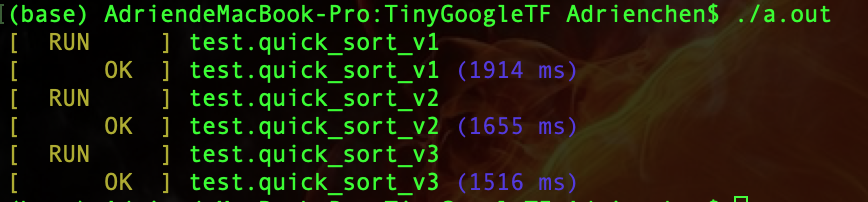

# 轻量级自动测试框架

C/C++  个人项目


C++的好处：兼容四种编程范式：

- 面向对象
- 面向过程
- 泛型编程
- 函数式编程


基础补充：

1.C++编译过程：


> - 编译：语法检查，生成对象文件（.o文件，包含定义， 可以用 nm -C 查看内容）
>  - 函数定义：能看到执行过程的代码
>   - 函数声明：看不到具体的实现，只是说明函数的存在
>- 链接：定义链接/整合
> 
> 
> 
> 静态链接和动态链接区别：
>
> - 最大区别是文件大小
>
> 定义和声明为什么要分开？
>
> - 声明可以帮助通过链接，定义可以是不同的实现


2. 预处理阶段：编译之前的一个阶段

- 待编译源码（代码形式）-> 经过编译称为目标文件（二进制）-> 经过链接成为可执行文件
- 功能：把所有预处理命令处理

- 预处理命令家族：'#'，所有成员以 '#' 开头
  - 例如：#include、#define
  - #include 工作原理分析：把后面文件中的内容，原封不动的粘贴过来
  - 查看待编译源码：`g++ -E filename.cpp > output.cpp`

- 条件式编译：
  - 功能作用：代码剪裁，保留和删除某些代码
  - 实现细节：必须以 ifdef 和 endif开头结尾
  - g++ -D 宏名name 文件名（也相当于定义了宏name）


问题答疑：

- 为什么需要 头文件include + 静态链接库lib？

  - 头文件作用：包含大量函数的声明，帮助源代码通过**编译**阶段

  - 静态链接库lib：包含第三方代码库的对象文件，即功能定义

    


---


难点介绍：

- 带颜色文字
- 怎么遍历
- TEST 是什么
- RUN_ALL_TEST：怎么知道测试用例的
- EXPECT系列功能实现


## 1. 调试信息的log日志打印功能

宏定义：一种预处理命令，在预处理阶段发生作用

- 工作原理：基本的文本替换（让编译器帮我写代码），比较容易理解的小例子

  ```
  #define S(a, b) a * b
  int n;
  S(int, p) = &n;
  ```

- 常用宏介绍：

- 非标准宏不建议使用，依赖于环境


功能实现

- 参数个数？：

  > 变参功能：可以输入任意多函数

- 输出信息：

  > 源文件 + 行号

- 具体实现：宏定义

  > 格式控制字符串`frm` + 变参列表`args`：
  >
  > ```c++
  > #define LOG(frm, args...){\
  > 	printf("[%s : %d]", __FILE__, __LINE__);\
  > 	printf(frm, ##args);\
  > 	printf("\n");\
  > }
  > ```
  >
  > - 例如：`"a = %d, b = %d"` + `a, b`
  >   - 可见，`args` 是变参，可能为为空，但是`printf(frm, args)`默认`args`非空，若空就会报错
  >
  > - 连接运算符: `##` 
  >   - 可以连接`frm`与`args`，此时`args`可以是空，所以应该使用`printf(frm, ##args)`
  > -  宏参数字符串化：`#` 


## 2. EXPECT系列

> 相同代码逻辑的冗余去除：**不同之处**用宏实现（帮我们写代码）

不同之处作为传入的参数，另外用一层宏来封装。


## 3. Color系列封装 

**3.1 printf彩色文字**

具体操作：配置 + 内容

配置信息：`printf("[\033 A1;A2;...m");`

- 配置信息是累加状态
- 代码规范：第一个属性是A1默认是0，屏蔽之前颜色信息对当前的影响


**3.2 使用宏封装**

第一层宏：实现配置操作（代码实现太冗余和复杂，宏让计算机自己实现）

```c++
// 以红色为例子
#define RED(msg) "\033[0;31m" msg "\033[0m"
```

第二层宏：实现多种颜色模式选择（每种颜色的实现是一样的，抽象出来让宏封装）

```c++
// 实现颜色选择
#define COLOR(msg, code) "\033[0;" #code "m" msg "\033[0m"
// 以红色为例子
#define RED(msg) COLOR(msg, 31)
```


## 4. `__attribute__` 完成函数注册 

放置在需要设置的函数上面，其中有一个属性 `constructor`，表示将函数设置为构造函数属性，其特点是**先于主函数执行**。

作用：实现系统注册函数

- FuncArr：用于存储函数的存储区
- 注册函数是一类保存函数信息的函数，可以**随机选择**（底层是数组存储）被注册的函数进行执行


## 5. TEST 封装

没有返回值和参数类型，合理猜测是宏实现的。

> 1）TEST展开后首先应该是一个函数的头部信息。
>
> TEST(a, b) -> void FuncName(a, b)() 
>
> FuncName(a, b) -> `wan_##a##_##b`
>
> 2）扩展出一个测试用例 -> 对应有一个注册函数（将其写入存储区）
>
> - 函数声明
> - 注册函数
> - 函数实现


## 6. RUN_ALL_TESTS

功能：依次扫描所有的测试用例并执行

实现：对一片存储区进行遍历，

> 存储区：简单实现用数组；优化实现用链表动态分配
>
> 存储内容：结构体，包含**函数地址、函数名**
>
> 存储区内容写入：注册函数！封装在TEST中


## 7. 总结

gtest vs wantest：

> 相同：都是用宏来实现，整体流程时一致的
>
> 不同：gtest封装的是class，wantest封装的是简单的功能函数


# 使用样例

分析STL的sort实现，并使用wantest进行测试。

首先，STL的sort方法主要是基于快速排序实现，并在此基础上进行优化，所以首先分析快速排序的思想。

其次，如何使用wantest进行样例测试：1）实现check函数，判断函数是否正确实现功能；2）利用wantest调用相对应的测试函数，比较check返回值是否正常，打印测试信息。


## 1. 快速排序

主要思想：

- 选择基准值（枢轴）
- partition分区
- 递归调用

基本实现：`quick_sort_v1`


## 2. 优化算法

STL实际上的实现不仅仅只是快速排序，可以说是集各家之长，根据具体情况（数据量、递归深度）自适应的调整排序算法。整体上，主要优化以下几个部分：

- 插入排序

> 思想：大数据使用快速排序进行分区，小数据使用插入排序快速调整
>
> 实现：设定一个 threshold = 16
>
> - 当[l, r]的数量小于等于threshold时转为插入排序
> - 相当于有m组数据，每组数据量小于等于16，组间有序，组内无序
> - 对m组进行插入排序，最坏时间复杂度是O(16n)——每个元素最多向前调整16位，共n个元素
>
> 注意：这里插入排序的实现也是参照STL，是效率最高的一种实现方法

- 堆排序

> 思路：深度控制，深度过深时调整为堆排序

- 单边递归法：优化递归调用次数
- 优化枢轴：[l, (l + r) >> 1, r]，三点取中法

- 无监督partition：双指针同时移动，采用交换而不是替换


## 3. 总结

STL中的快速排序算法实现思路如下：

- 开始排序，传入带排序区间范围
- 对区间做partition操作（分区-无监督、枢轴-三点取中、递归次数-单边递归法）
- 元素数量 <= threshold，区间停止快速排序
- 递归深度控制：超过一定深度，采用heap-sort堆排序
- 最后收尾排序采用inset-sort插入排序


## 4. 测试分析

结果展示：采用v3版本的快速排序效率提升约20%



